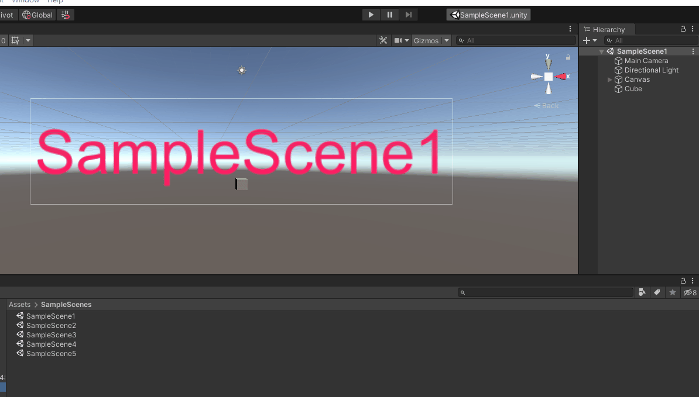

# Unity-Recent-Scene-Toolbar
Add Recent Scene button to quickly access recent scenes.

The maximum number is 10 by default. (By the const value in `RecentSceneList.cs`)

# Installation
## 1. Download repo and put into `Assets/`
THE HARDEST WAY EVER
## 2. Unity Package Manager
1. [Installing package from a Git URL](https://docs.unity3d.com/Manual/upm-ui-giturl.html)
2. `https://github.com/qwe321qwe321qwe321/Unity-Recent-Scene-Toolbar.git`

**Since package isn't able to create scriptable object, the `RecentSceneList.asset` will be created in `Assets/Recent-Scene-Toolbar/Editor` by default. It can be anywhere you like in the project. And you should add it to `.gitignore` manually to prevent tracking**

# How is it done
* Hook up the `EditorSceneManager.activeSceneChangedInEditMode` to record the scenes to a scriptable object `RecentSceneList.asset`.

  * `RecentSceneList.asset` will be generated if it doesn't exist.

  * The `.gitignore` in `Editor` folder is used to prevent git tracking `RecentSceneList.asset` which always change when you switch scene.

* The toolbar UI solution is by https://github.com/marijnz/unity-toolbar-extender. (it's only proven to work up to (at least) Unity 2020.1.)
* Editor icons: https://github.com/nukadelic/UnityEditorIcons
